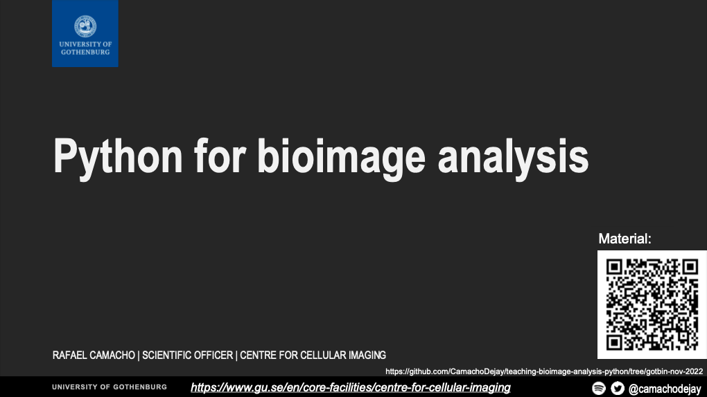

# Teaching Bioimage Analysis with Python

List of resources used during different courses, workshops, events, etc.

## GOTBIN presentation and demo

* The material (PDF) used for the presentation is available [here](./quick_demo_gotbin_nov_2022/pdf/GOTBIN-2022.pdf)

* The Jupyter Notebooks and python code used for the quick demo can be found [here](./quick_demo_gotbin_nov_2022).